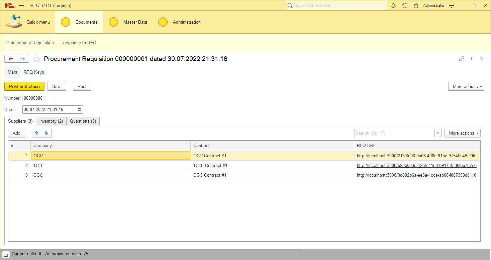

# RFQ

This is a little and functionally truncated part of a large project. I published it as a working example of an external interface for 1C:Enterprise.

## What is it for?

There is a 1C:Enterprise infobase intended to store all data the application work with. Being authenticated, a user can create a Procurement Requisition document.

It's interface has three tabs. First one is a list of suppliers:


The second one is a list of inventory to ask for price:


The last tab is a list of questions a user wants to ask a supplier: 


After the document is created, it becomes possible to fill a response to web interface via links from `RFQ URL` column. Each of them is unique and corresponds to the supplier (and contract with it) specified in the line. So a user can send each link to a supplier, then wait for response.

When a supplier follows a link received from a user, it looks like a simple page with a list of inventory to set price, and a list of questions to answer for. It does not require authentication in any way.


Below the fields a supplier has two buttons to press: `Save as Draft` and `Submit`. First one saves all entered data in the 1C:Enterprise infobase; when a supplier tries to open the same RFQ URL later, all the entered data will remain in place.

The second one means that all the needful data are entered. The response will be saved. The RFQ URL will become unavailable from this point.

## How does it work?

The application lies on three whales:

1. 1C:Enterprise infobase (backend). Stores all data and provides a REST HTTP service to operate with it. 
2. REST proxy service. Made on Python (Flask framework, to be certain). Able to authenticate on REST HTTP service of 1C:Enterprise infobase. Transfer data from the web application to 1C:Enterprise and back.
3. Web application (React.js). The only visible part for a user within direct access to the 1C:Enterprise infobase. 


## How to start the application?

As mentioned above, the project consist of three sections — two for backend and one for frontend. Let's make they work.

### 1. 1C:Enterprise

You need to do the following steps:
4
1. Load a 1C:Enterprise infobase configuration from the [1c-enterprise](1c-enterprise) directory.
2. Create at least two users in the infobase:
   - a superuser (must have the `Full Access` role assigned)
   - a user for external HTTP requests (assign the role `RFQ` to it)
3. Fill `RFQ Interface URL` constant's value (Administration → Tools → RFQ Interface URL). For instance: `http://localhost:3000`  
4. Create master data: several companies, contracts, items, and questions. You need this to make procurement requisitions.
5. Create at least one `Procurement Requisition` document, then post it.
6. Publish `RFQ` HTTP service on your web server.

At this point, one of your `Procurement Requisition` documents may look like this:



### 2. Flask Gateway

Now you need to enable a sort of gateway between a 1C:Enterprise infobase and a web interface.

It needs to know how to connect to the HTTP service of the 1C:Enterprise infobase. So create three environment variables which are listed below. If you use Windows, you can do it via `Windows + R` → `sysdm.cpl` → `Advanced` → `Environment Variables`.

| Variable Name     | Example Value                         | Meaning                                                       |
|-------------------|---------------------------------------|---------------------------------------------------------------|
| `RFQ_1C_URL`      | `http://localhost/RFQInfobase/hs/RFQ` | URL of the 1C:Enterprise HTTP service that you have published | 
| `RFQ_1C_USERNAME` | `RFQ User`                            | Login of a 1C:Enterprise user with the RFQ role assigned      |
| `RFQ_1C_PASSWORD` | `123`                                 | Password of the 1C:Enterprise user                            |

Now simply run the `api.py` script:

```commandline
python api.py
```

You will see something like this:

```
 * Serving Flask app 'api' (lazy loading)
 * Environment: production
   WARNING: This is a development server. Do not use it in a production deployment.
   Use a production WSGI server instead.
 * Debug mode: off
 * Running on http://127.0.0.1:5000 (Press CTRL+C to quit)
```

Have a look at the last line. As you can see, your gateway URL is http://127.0.0.1:5000. You can check whether `the gateway works or not; try to access the URL below using a browser:

```
http://127.0.0.1:5000/Ping
```

In case of success, you're going to get this response:

```json
{"Result": true}
```

It means that the gateway have connected to the 1C:Enterprise infobase, so everything is fine so far. 

### 3. React.js Web Application

Finally, it is time to start a web interface. All files you need located in [react-web-app](react-web-app) directory. 

At first, please make sure that the URL of Flask application you got above (`http://127.0.0.1:5000`) is equal to a value of a REACT_APP_SERVER_URL parameter in [.env.local](react-web-app/.env.local) file. Secondly, you need to download tons of npm libraries to make React.js work:

```commandline
npm install
```

Wait until the procedure ends. Have patience, it may take some time.

Then, start a development server:

```commandline
npm start
```

You will see something like this: 

```
Compiled successfully!

You can now view rfq in the browser.

  Local:            http://localhost:3000
  On Your Network:  http://192.168.0.105:3000

Note that the development build is not optimized.
To create a production build, use npm run build.
```

Make sure that the local address mentioned above is equal to the value of `RFQ Interface URL` constant you have set before.

I would like to point out that you will have your browser opened with the 404 error immediately after server start. It doesn't mean you did something wrong because it is intended behavior: the only page that the web application shows is a RFQ form. If no RFQ key provided in URL or the key can't be found, the 404 error appears. 

### 4. Done! 

Now you are able to follow links in the `RFQ URL` column of a `Procurement Requisition` document. For instance, you get something like this:

