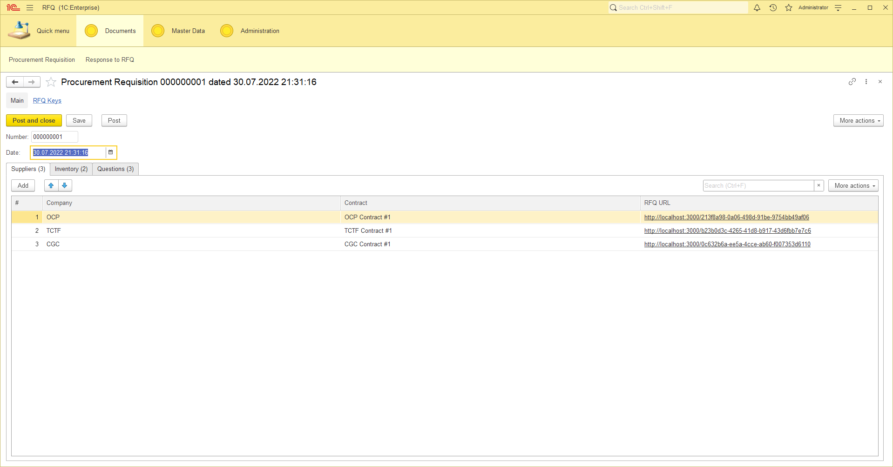
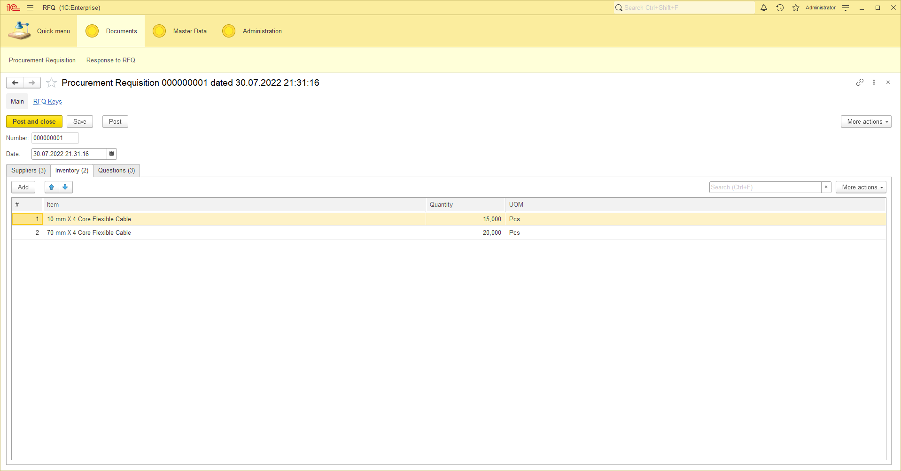
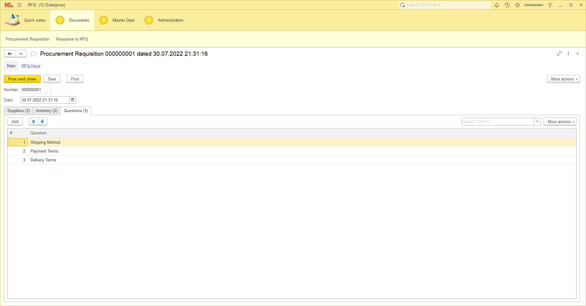
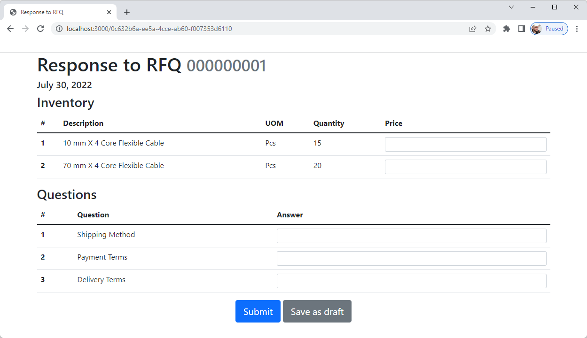

# 🏪 🛍️ 💰 RFQ

This is a little and functionally truncated part of a large project. I published it as a working example of an external interface for 1C:Enterprise.

It will help someone who has no clue how to solve a some similar task.


## 😌 What is it for?

Well, there is a 1C:Enterprise infobase intended to store all data the application work with. Being authenticated, a user of the infobase can create a Procurement Requisition document.

It's interface has three tabs. First one is a list of suppliers:



The second one is a list of inventory to ask for price:



The last tab is a list of questions a user wants to ask a supplier: 



After the document is saved, it becomes possible to fill a response for quotation (RFQ) using a web browser. Have a look at links in a `RFQ URL` column in the `Suppliers` tab: each of them is unique and corresponds to the supplier (and contract with it) specified in the line. So a user can send each link to a supplier, then wait for response.

When a supplier follows a link received from a user, they see a simple page with a list of inventory to set price, and a list of questions to answer for. Please note it does not require authentication in any way.



Below the fields a supplier has two buttons to press: `Save as Draft` and `Submit`. First one saves all entered data in the 1C:Enterprise infobase; if a supplier tries to open the same URL later, all the entered data remains in place.

If a supplier press the `Submit` button it means that all the needful data are entered. So prices & answers will be saved in the 1C:Enterprise infobase. The URL will become unavailable from this point.

In both cases entered data stores as a `Response to RFQ` document. If a supplier just saves it as a draft, the document is not posted. And if a response is submitted, the corresponding document is posted. 

## 😎 How does it work?

The project lies on three whales:

1. Web interface (React.js). The only visible part for a user within direct access to the 1C:Enterprise infobase. 
2. REST proxy service. Made on Python (Flask framework, to be certain). This application intended to transfer data from the web interface to 1C:Enterprise and back, so it is able to authenticate on REST HTTP service of 1C:Enterprise infobase. 
3. 1C:Enterprise infobase. Stores data and provides a REST HTTP service to operate with it. 


## 🤨 How to start the application?

As mentioned above, the project consist of three sections. Let's make they work.

### 1. 1C:Enterprise infobase

You need to do the following steps:

1. Load a 1C:Enterprise infobase configuration from the [1c-enterprise](1c-enterprise) directory.
2. Publish `RFQ` HTTP service of the infobase on your web server. 
3. Create at least two users in the infobase:
   - a superuser (must have the `Full Access` role assigned)
   - a user for external HTTP requests (assign the role `RFQ` to it)
4. Fill `RFQ Interface URL` constant's value (Administration → Tools → RFQ Interface URL). You can use a `http://localhost:3000` value so far.  
5. Create master data: several companies, contracts, items, and questions. You will need those later to make procurement requisitions.
6. Create at least one `Procurement Requisition` document, then post it. You need to add at least one line of each tabular section.  

### 2. Proxy

Now you need to enable a sort of proxy between the 1C:Enterprise infobase and a web interface.

Have a look at the [flask-proxy](flask-proxy) directory. There is a `api.py` script you must set up.

Generally, it only needs to know how to connect to the HTTP service of the 1C:Enterprise infobase. So create three environment variables which are listed below. If you use Windows, you can do it via `Windows + R` → `sysdm.cpl` → `Advanced` → `Environment Variables`.

| Variable Name     | Example Value                         | Meaning                                                       |
|-------------------|---------------------------------------|---------------------------------------------------------------|
| `RFQ_1C_URL`      | `http://localhost/RFQInfobase/hs/RFQ` | URL of the 1C:Enterprise HTTP service that you have published | 
| `RFQ_1C_USERNAME` | `RFQ User`                            | Login of a 1C:Enterprise user with the RFQ role assigned      |
| `RFQ_1C_PASSWORD` | `123`                                 | Password of the 1C:Enterprise user                            |

Now simply run the `api.py` script:

```commandline
python api.py
```

You will see something like this:

```
 * Serving Flask app 'api' (lazy loading)
 * Environment: production
   WARNING: This is a development server. Do not use it in a production deployment.
   Use a production WSGI server instead.
 * Debug mode: off
 * Running on http://127.0.0.1:5000 (Press CTRL+C to quit)
```

Have a look at the last line. As you can see, your gateway URL is http://127.0.0.1:5000. You can check whether `the gateway works or not; try to access the URL below using a browser:

```
http://127.0.0.1:5000/Ping
```

In case of success, you're going to get this response:

```json
{"Result": true}
```

It means that the proxy has connected to the 1C:Enterprise infobase, so everything is fine. 

### 3. Web interface

Finally, it is time to start the web interface. All files you need located in [react-web-app](react-web-app) directory. 

At first, please make sure that the URL of Flask application you got above (`http://127.0.0.1:5000`) is equal to a value of a REACT_APP_SERVER_URL parameter in [.env.local](react-web-app/.env.local) file. Secondly, you need to download tons of npm libraries to make React.js work:

```commandline
npm install
```

Wait until the procedure ends. Have patience, it may take some time.

Then, start a development server:

```commandline
npm start
```

You will see something like this: 

```
Compiled successfully!

You can now view rfq in the browser.

  Local:            http://localhost:3000
  On Your Network:  http://192.168.0.105:3000

Note that the development build is not optimized.
To create a production build, use npm run build.
```

Make sure that the local address mentioned above is equal to the value of `RFQ Interface URL` constant you have set before.

I would like to point out that you will have your browser opened with the 404 error immediately after server start. It doesn't mean you did something wrong because it is intended behavior: the only page that the web application shows is a RFQ form. If no RFQ key provided in URL or the key can't be found, the 404 error appears. 

### 4. Done! 

Now you are able to follow links in the `RFQ URL` column of a `Procurement Requisition` document. Great work!

## 😇 What if something is not working properly?

Well, all of above are for educational purposes, so everything can happen ¯\\_(ツ)_/¯

However, I have included some information which may help you to fix a problem.

### Known Issues

1. The `Price` field in `Inventory` table of the web interface has no control of length or precision, which can possibly lead to data loss.
2. The `Answer` field in `Questions` table is open-ended, and the respective field in the 1C:Enterprise has no limits as well. It can lead to a problem if a user tries to set massive amount of text as answer.

### Error Codes

Instead of a normal response, HTTP service of 1C:Enterprise API may return error, as well as the proxy script. It always has two values only: `ErrorCode` & `ErrorText`. For instance:

```json
{"ErrorCode": 200, "ErrorText": "No endpoint specified."}
```
  
If an ErrorCode value begins with 1 (for instance: 100, 101 etc.), it means that error has occurred in 1C:Enterprise. If the value begins with 2, it means that error has occurred in the proxy script.

`ErrorText` contains a description of the problem, depending on a reason. For instance, if an error is occurred in 1C:Enterprise, it contains detail description of the exception.

| Code | Meaning                                                                                                                 |
|------|-------------------------------------------------------------------------------------------------------------------------|
| 100  | 1C:Enterprise exception has occurred. It's recommended to check the infobase event log.                                 |
| 101  | 1C:Enterprise is unable to find key specified in the information register `RFQKeys`.                                    |
| 102  | 1C:Enterprise is unable to create or update a `Response to RFQ` document since it already exists and posted.            |
| 103  | 1C:Enterprise is unable to get a `Response to RFQ` document because there are many of them by conditions given.         |
| 200  | Proxy script throws this one if there is no endpoint specified. This one is unlikely to see in a production deployment. |
| 201  | Proxy script sent request to 1C:Enterprise HTTP service, but received HTTP status code differs from 200.                |