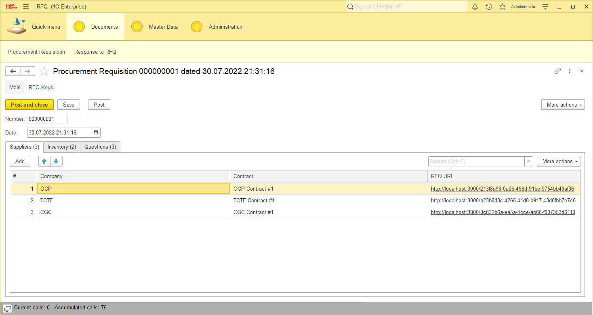
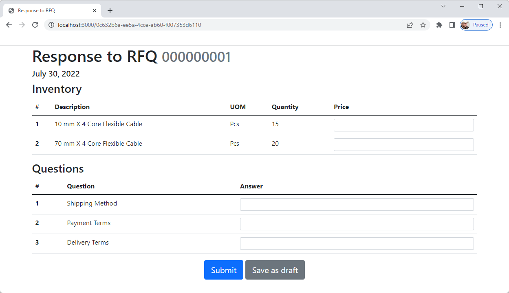

# RFQ

It is the working example of an external interface for 1C:Enterprise which has been made with React.js & Flask.

## How to start?

### 1. Setting up 1C:Enterprise

Do the following steps:

1. Load a 1C:Enterprise configuration from the [1c-enterprise](1c-enterprise) directory.
2. Create at least two users: a superuser (must have the `Full Access` role assigned) and a user for HTTP requests (assign the role `RFQ` to it).
3. Fill a `RFQ Interface URL` constant's value (Administration → Tools → RFQ Interface URL). For instance: `http://localhost:3000`  
4. Create master data: several companies, contracts, items, and questions. You need this to make procurement requisitions.
5. Create at least one `Procurement Requisition` document, then post it.
6. Publish `RFQ` HTTP service on your web server.

At this point, one of your `Procurement Requisition` documents may look like this:



### 2. Setting up Flask gateway

Now you need to enable a sort of gateway between a 1C:Enterprise infobase and a web interface.

It needs to know how to connect to the HTTP service of the 1C:Enterprise infobase. So create three environment variables which are listed below. If you use Windows, you can do it via `Windows + R` → `sysdm.cpl` → `Advanced` → `Environment Variables`.

| Name              | Example                                 | Meaning                                                       |
|-------------------|-----------------------------------------|---------------------------------------------------------------|
| `RFQ_1C_URL`      | `"http://localhost/RFQInfobase/hs/RFQ"` | URL of the 1C:Enterprise HTTP service that you have published | 
| `RFQ_1C_USERNAME` | `"RFQ User"`                            | Login of a 1C:Enterprise user with the RFQ role assigned      |
| `RFQ_1C_PASSWORD` | `"123"`                                 | Password of the 1C:Enterprise user                            |

Now simply run the `api.py` script:

```commandline
python api.py
```

You will see something like this:

```
 * Serving Flask app 'api' (lazy loading)
 * Environment: production
   WARNING: This is a development server. Do not use it in a production deployment.
   Use a production WSGI server instead.
 * Debug mode: off
 * Running on http://127.0.0.1:5000 (Press CTRL+C to quit)
```

Have a look at the last line. As you can see, your gateway URL is http://127.0.0.1:5000. You can check that whether the gateway works or not; try to access the URL below using a browser:

```
http://127.0.0.1:5000/Ping
```

In case of success, you're going to get this response:

```json
{"Result": true}
```

It means that the gateway have connected to the 1C:Enterprise infobase, so everything is fine so far. 

### 3. Frontend: React Web App

Firstly, you need to download tons of npm libraries to make React.js work. So do it the [react-web-app](react-web-app) directory:

```commandline
npm install
```

Wait till the procedure ends. Have patience, it may take some time.

Then, start a development server:

```commandline
npm start
```

You are going to see something like this: 

```
Compiled successfully!

You can now view rfq in the browser.

  Local:            http://localhost:3000
  On Your Network:  http://192.168.0.105:3000

Note that the development build is not optimized.
To create a production build, use npm run build.
```

Make sure that the local address mentioned above is equal to the value of `RFQ Interface URL` constant you have set before.

Please note that you will have your browser opened with the 404 error. You didn't do anything wrong, it is intended behaviour: the only page that the web application shows is a RFQ form. If no RFQ key provided in URL or the key can't be found, the 404 error appears. 

### 4. Done! 

Links in the `RFQ URL` column of a `Procurement Requisition` document now work. If you click, you get something like this:

